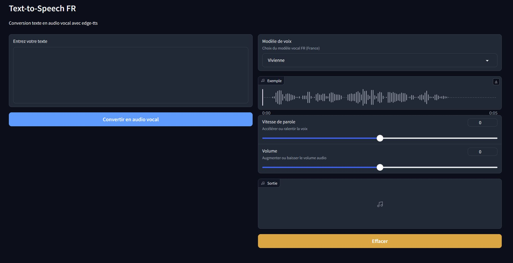

# edge-tts-webui

`edge-tts-webui-FR` est un fork en français do projet [edge-tts-webui](https://github.com/ycyy/edge-tts-webui), utilisant des modèles de voix en français et s'appuyant sur le projet [edge-tts](https://github.com/rany2/edge-tts)



## Prérequis
Python et pip doivent être installés.


    pip install edge-tts
    pip install gradio
    pip install asyncio

## Utilisation

    python app.py
    ou
    lancer Edge-TTS-WebUI.bat

Le navigateur s'ouvre automatiquement sur la page
```
http://localhost:7860
```
